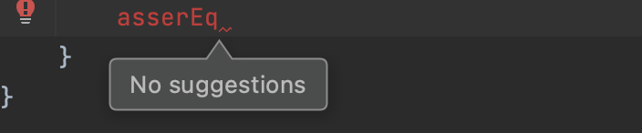
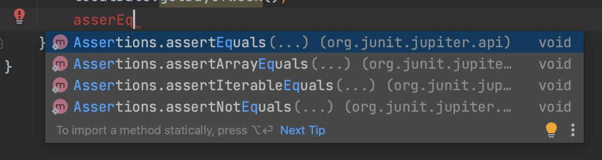
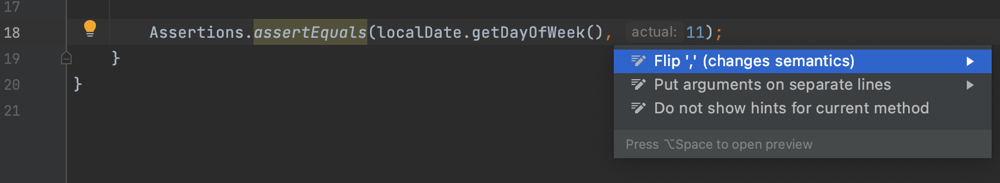

## 1. Shortcuts
* **Escape** to focus on editor window
* "Select opened file" in navigator (assign custom shortcut: **Option + O**)
* "Show/Hide Build window" (assign custom shortcut: **CMD + Escape**) 
* "Hide all tool windows" (assign custom shortcut: **CMD + Shift + Escape**)

### 1.1 In Editor
* `LocalDate.parse(date, );` Control + Shift + Space (smart completion),
  only show options that correspond to the expected type of the parameter.
* `LocalDate.parse(date, DateTimeFormatter.ofPattern("dd.MM.yyyy"));` anywhere
  in preceding line of code press "**Option + Command + v**" to extract a variable
  of a specific return type.
* **Create a <u>for/foreach loop</u> over integers in one click:**
  ```
  ArrayList<Integer> integers = new ArrayList<>();
  integers.for //hit Control space
  ```
* By pressing `Control + Space` twice you ask IntelliJ to look for options outside
  already imported libraries, deeper in the troves.
  **Control + Space (Once):**
  
  **Control + Space (Twice):**
  
* Using **"Quick Fix"** functionality: `Alt + Enter` you can fix common
  situations, like flip arguments around in a method call with two arguments:
  
* **Optimize Imports**: remove unused imports from top of the file: `Ctrl + Alt + O`
* **Inline variable**: replace all usages of the variable in with its value
  and remove the variable definition: `Option + Command + N`

## Tips
* Use Generators more in editor
